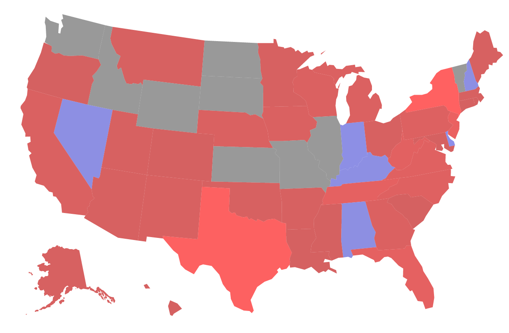

## tweek

  1. Scrape twitter for tweets regarding a certain topic of interest.
  2. Collect via sqlite3
  3. Send data up via socketio
  4. Display the metric onto a topology of the United States using express and d3


## Prerequisites

You will need the following things properly installed on your computer.

* [Git](http://git-scm.com/)
* [Node.js](http://nodejs.org/) (with NPM)
* [Bower](http://bower.io/)
* [Ember CLI](http://www.ember-cli.com/)
* [PhantomJS](http://phantomjs.org/)

## Installation

* `git clone <repository-url>` this repository
* change into the new directory
* `npm install`
* `bower install`

## Running / Development

* `ember server`
* Visit your app at [http://localhost:4200](http://localhost:4200).

### Code Generators

Make use of the many generators for code, try `ember help generate` for more details

### Running Tests

* `ember test`
* `ember test --server`

### Building

* `ember build` (development)
* `ember build --environment production` (production)

### Deploying

#### Running the application

```bash
git clone https://github.com/srowhani/tweek.git;
npm install && bower install;
./bin/www;
```
#### Starting the scraper

```bash
cd $PATH_TO_tweek_REPO
./bin/tweek.js 'c,s,v';
```

## Further Reading / Useful Links

* [ember.js](http://emberjs.com/)
* [ember-cli](http://www.ember-cli.com/)
* Development Browser Extensions
  * [ember inspector for chrome](https://chrome.google.com/webstore/detail/ember-inspector/bmdblncegkenkacieihfhpjfppoconhi)
  * [ember inspector for firefox](https://addons.mozilla.org/en-US/firefox/addon/ember-inspector/)
