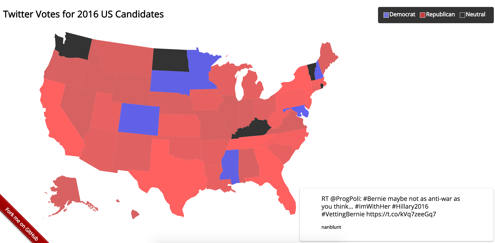
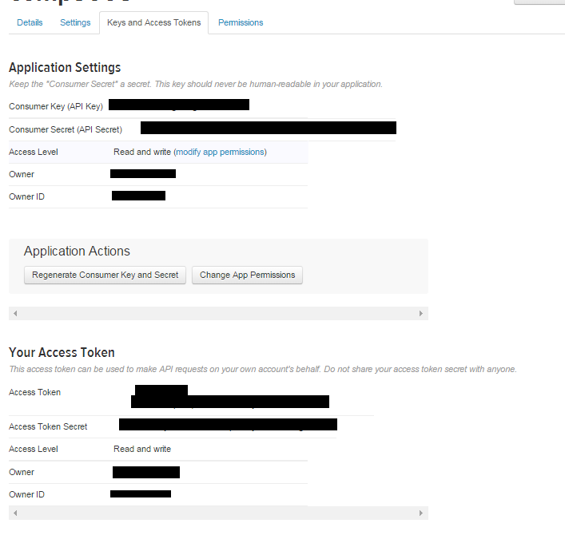

## democracy 

See the [demo](http://159.203.14.152:3000) for reference.

  1. Scrape twitter for tweets regarding a certain topic of interest.
  2. Collect via sqlite3
  3. Send data up via socketio
  4. Display the metric onto a topology of the United States using express and d3


## Prerequisites

You will need the following things properly installed on your computer.

* [Git](http://git-scm.com/)
* [Node.js](http://nodejs.org/) (with NPM)
* [Bower](http://bower.io/)
* [Ember CLI](http://www.ember-cli.com/)
* [PhantomJS](http://phantomjs.org/)

## Installation

* `git clone <repository-url>` this repository
* change into the new directory
* `npm install`
* `bower install`

## Running / Development

* `npm run serve`
* Visit your app at [http://localhost:4200](http://localhost:4200).

### Running Tests

* `ember test`
* `ember test --server`

### Building

* `ember build` (development)
* `ember build --environment production` (production)

### Deploying

#### Running the application

```bash
git clone https://github.com/srowhani/democracy.git;
npm install && bower install;
npm run serve;
```
#### Starting the scraper

```bash
cd $PATH_TO_democracy_REPO
npm run job "c,s,v';
```

The scraper requires a [twitter developer key](https://apps.twitter.com/). 

You need to set some environment variables to get started.
The scraper relies on this here. And it's not too verbose about whether the info is correct or not.

```js
  var client = new Twitter({
    consumer_key: process.env.TWITTER_CONSUMER_KEY,
    consumer_secret: process.env.TWITTER_CONSUMER_SECRET,
    access_token_key: process.env.TWITTER_ACCESS_KEY,
    access_token_secret: process.env.TWITTER_ACCESS_SECRET,
  });
```

You'll have to export the following in whatever shell you use.

```bash
 export TWITTER_CONSUMER_KEY=<consumer_key>
 export TWITTER_CONSUMER_SECRET=<secret>
 export TWITTER_ACCESS_KEY=<access_key>
 export TWITTER_ACCESS_SECRET=<access_secret>
```
You can get these variables from twitters app dev dashboard.



## Further Reading / Useful Links

* [ember.js](http://emberjs.com/)
* [ember-cli](http://www.ember-cli.com/)
* Development Browser Extensions
  * [ember inspector for chrome](https://chrome.google.com/webstore/detail/ember-inspector/bmdblncegkenkacieihfhpjfppoconhi)
  * [ember inspector for firefox](https://addons.mozilla.org/en-US/firefox/addon/ember-inspector/)
